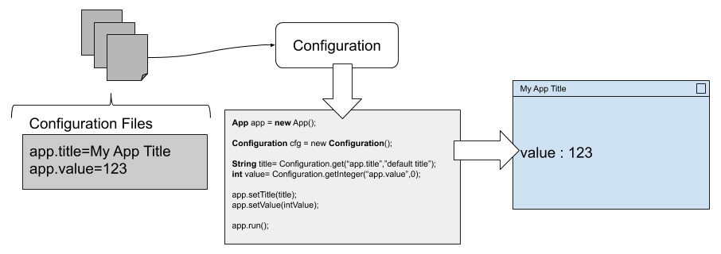

# Configuration class

[github project](https://github.com/mcgivrer/configuration "Go and visit the github repository")

The `Configuration` class is a very simple helper to retrieve configuration value from the `res/configuration.properties` file.

## Constructor

- The `Configuration()` is the default constructor, loading the `configuration.properties` default file.
- the `Configuration(String filePath)` will load configuration values from the `filePath` file.
- and the `Configuration(String[] filePaths)` will load all configuration values from all the files from the `String[]` array.

## API

The propose API contains the following  public helpers:

- `get(String key, String defaultValue)` to retrieve a String value. if not found, the default value is returned.
- `getInteger(String key, Integer defaultValue)` to retrieve an int value. if not found, the default value is returned.
- `getFloat(String key, Float defaultValue)` to retrieve an float value. if not found, the default value is returned.
- `getBoolean(String key, Boolean defaultValue)` to retrieve an boolean value. if not found, the default value is returned.
- `getDate(String key, Date defaultValue)` to retrieve an Date value. if not found, the default value is returned. the date format is "yyyy-mm-dd hh:mm:ss" (Java format is "y-M-d h:m:s").

## Test ?

To see resulting API access test, just execute the Junit/Cucumber tests.

McG@2019-05-21
